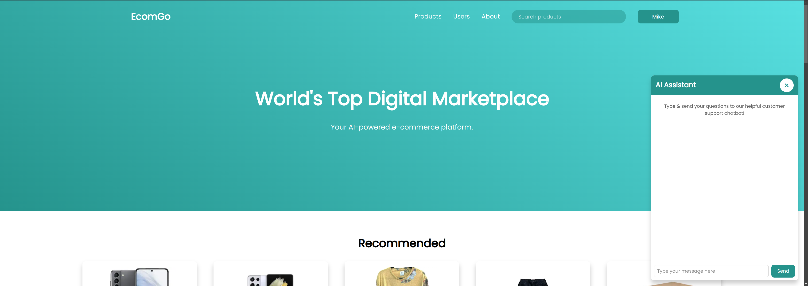
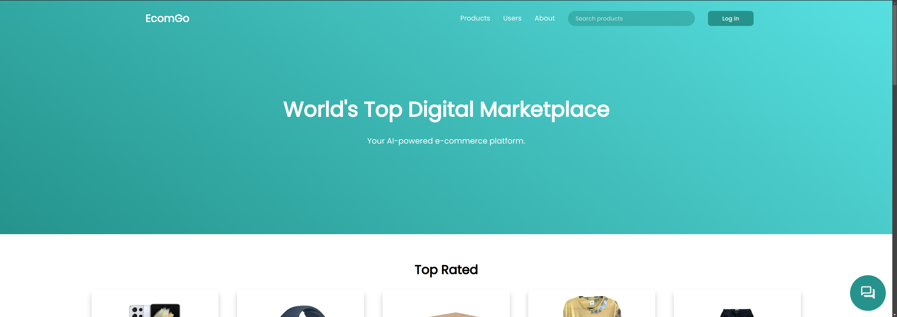
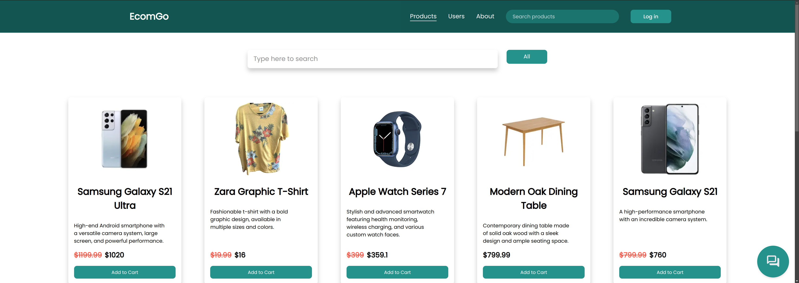
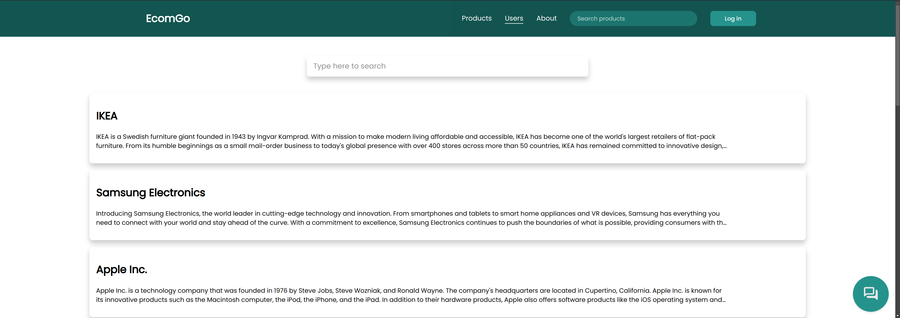
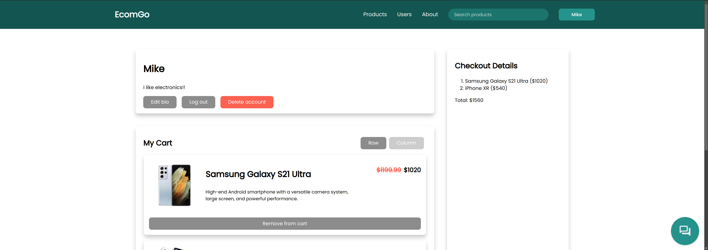

# AI-Powered E-Commerce Website
<u>Problem statement</u>: A fictional e-commerce company named "EcomGo" wants to integrate AI technology in their website to enhance user experience (UX) and customer satisfaction. Their plan was to add the following AI-powered features:

- **Chatbot Assistant**: It uses a large language model (LLM) that has access to the company's internal database of products, manufacturers, and other helpful information (e.g., discounts & promotions).
- **Review Analyst**: The company considers using an internal model that reads a customer's review on a particular product to determine their message's sentiment (positive, neutral, or negative). Reviews with positive sentiment are colored green in the website, ones with negative are colored red, whereas the neutral ones are colored white; in addition, reviews with the same sentiment are grouped together. This AI feature is useful for customers as they can quickly estimate the public's opinion about a specific product before buying it.
- **Product Recommender**: A fast, up-to-date AI recommender is used to suggest products to customers based on their past interactions with products.

<u>Solution</u>: This is where they hire me to implement and integrate all of these features into the web application.



## Custom AI Models
Here is a more detailed description for each aforementioned model:
- **Chatbot Assistant**:
    1. A customer asks a question by typing & sending the prompt.
    2. The chatbot intelligently determines whether the customer is asking for a specific product(s) or a manufacturer(s).
    3. It then decides to query EcomGo's internal database, fetching relevant information needed to answer the customer's question. It can also retrieve information about the customer inquiring it such as their name and bio. This is a great example of a RAG (Retrieval-Augmented Generation) system.
    4. Responds with a nicely-formatted response.
- **Review Analyst**:
    1. An LLM specialized for analyzing sentiments intelligently.
    2. Preprocesses and postprocesses customer and output data respectively.
    3. Predicts and displays the sentiment of the customer on a product given only their review about it.
- **Product Recommender**:
    - ETL (Extract, Transform, Load) data pipeline runs in the background for every 4 minutes:
        1. Extracts customer-product interaction data (e.g., rating, cart).
        2. Loads & processes the data.
        3. Saves the processed data to a file to keep the model up-to-date with customer preferences.
    - During inference:
        1. When recommendations are about to be generated, the saved processed data is loaded.
        2. The model uses similarity to determine what products to recommend to a particular customer.
        3. If the customer is logged in, the recommended products are shown in the main page to the customer.

## DevOps Features
- **Microservice infrastructure**: The whole app is divided into several microservices: frontend, backend, and database. All of which communicate seamlessly.
- **Containerized app with Docker**: I use Docker to build a container for each microservice. I then use Docker Compose to run the whole containerized app on any machine that has Docker & Docker Compose installed. This is very useful for running automated tests of CI/CD pipelines with GitHub Actions and for collaboration.
- **Automated testing**: Before adding a new feature to the production branch, the whole app is tested to ensure that the new feature to be integrated does not conflict with the system's original components. I wrote about 47 unit & integration tests for this project.
- **Stateful application**: This app stores most data persistently that does not get deleted when customers refresh or close the website.
- **Automated logging**: If any parts of the web app are failing or misbehaving, information is logged into the system to aid troubleshooting.
- **CI/CD**: When pushing the code to GitHub for hosting & deploying to the cloud, the automated tests are ran in isolated environments before being integrated into the main app. 
- **Modular code**: Maintaining reusable code is crucical, which is what this app supports.
- **Scripts**: Code that is repetitively executed is put in a script to save time and effort.

## Data
- Product data was generated by Llama LLMs.
- Some names of the product manufacturers are real registered trademarks.
- Images, hosted by Amazon and others, were downloaded from the web.

## Tech Stack
Here are all the tools that I used to create this project:
- AI:
    - ML framework: **LangChain**.
    - Self-hosted LLMs (using Ollama):
        - **Llama 3 (8B)** for accuracy in some tasks (4.7 GB).
        - **Llama 3.2 (1B)** for accuracy & speed in other tasks (1.3 GB).
- Frontend:
    - **Next.js & TypeScript** for website programming.
    - **SASS** for website styling.
- Backend:
    - **Python** for back-end functionality.
    - **PostgreSQL** for the database.

## License & Purpose
This project is licensed under the **MIT License**. See the [LICENSE](./LICENSE) file for more details.

The primary goal of this project is to demonstrate my full-stack development skills, particularly in integrating AI technology into an existing system (in this case, a website). It is intended as a showcase of my technical abilities and for educational purposes.


## Installation
1. **Prerequisites**: Make sure you have Docker, Docker Compose (Standalone), and NVIDIA toolkit for Docker. I made my containers use my RTX 4080 GPU in this project, so make sure you have a compatible NVIDIA GPU. After that, make sure you are in the root directory of this whole project for the below commands to work.

2. **Running the app**: Because this project uses Docker Compose, it is easy to run the containerized app:
    ```sh
    sh run.sh
    ```
    Wait around 15 minutes to ensure the containers finish setting up properly, then open your web browser and navigate to http://localhost:3000 to view the website.

3. **Cleaning up**: Once you're done trying this app, run the below commands on another terminal:
    ```sh
    sh clean_up.sh
    ```

## Preview
### Landing Page
This is what logged-out customers will see.




### Products Section
Customers can search for products sold.




### Users Section
Customers can search for manufacturers (users) in this platform.




### Account
Logged-in customers can manage their account and cart. In addition, they will have access to personalized recommendations of products in the home page.

